# Manual do Usuario - RH Folha

Versao preliminar do MVP: 11/06/2026

Este manual apresenta o uso operacional do sistema RH Folha, com foco nos cadastros, lancamentos, competencias, producao, relatorios, configuracoes, integracao Dapic, usuarios e auditoria.

As telas foram capturadas a partir do ambiente local de desenvolvimento. Em homologacao ou producao, a aparencia deve ser a mesma, mudando apenas a URL de acesso e os dados cadastrados.

## 1. Acesso ao sistema

O acesso e feito pela tela de login. Cada usuario deve usar seu e-mail e senha autorizados.

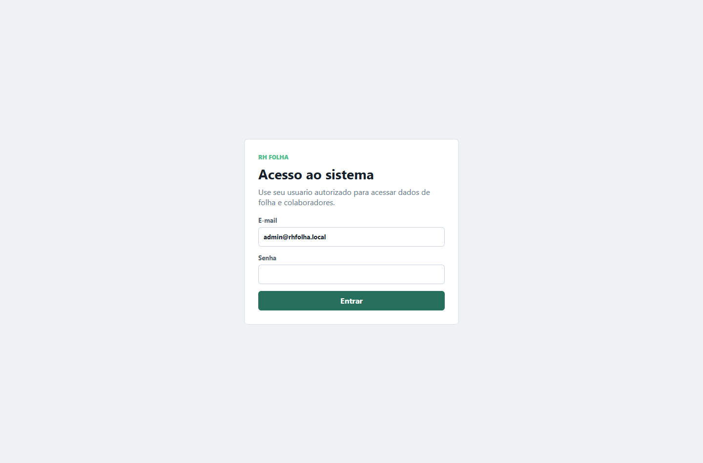

Boas praticas:

- use usuarios individuais, evitando compartilhamento de senha;
- mantenha usuarios de leitura sem acesso a acoes de cadastro ou alteracao;
- revise periodicamente usuarios inativos;
- altere senhas iniciais antes do uso em producao.

## 2. Navegacao geral

O sistema possui menu lateral com os principais modulos:

- Dashboard;
- Colaboradores;
- Estrutura;
- Rubricas;
- Competencias;
- Conferencia;
- Lancamentos;
- Producao;
- Relatorios;
- Configuracoes.

No topo, o usuario autenticado pode atualizar a tela ou sair do sistema.

Mensagens seguem o padrao:

- verde para sucesso;
- vermelho para erro;
- amarelo ou laranja para alertas;
- mensagens modais para confirmacoes importantes.

## 3. Dashboard

O Dashboard mostra uma visao geral da empresa, com indicadores de colaboradores, rubricas, lancamentos, competencias, pendencias operacionais e acoes rapidas.

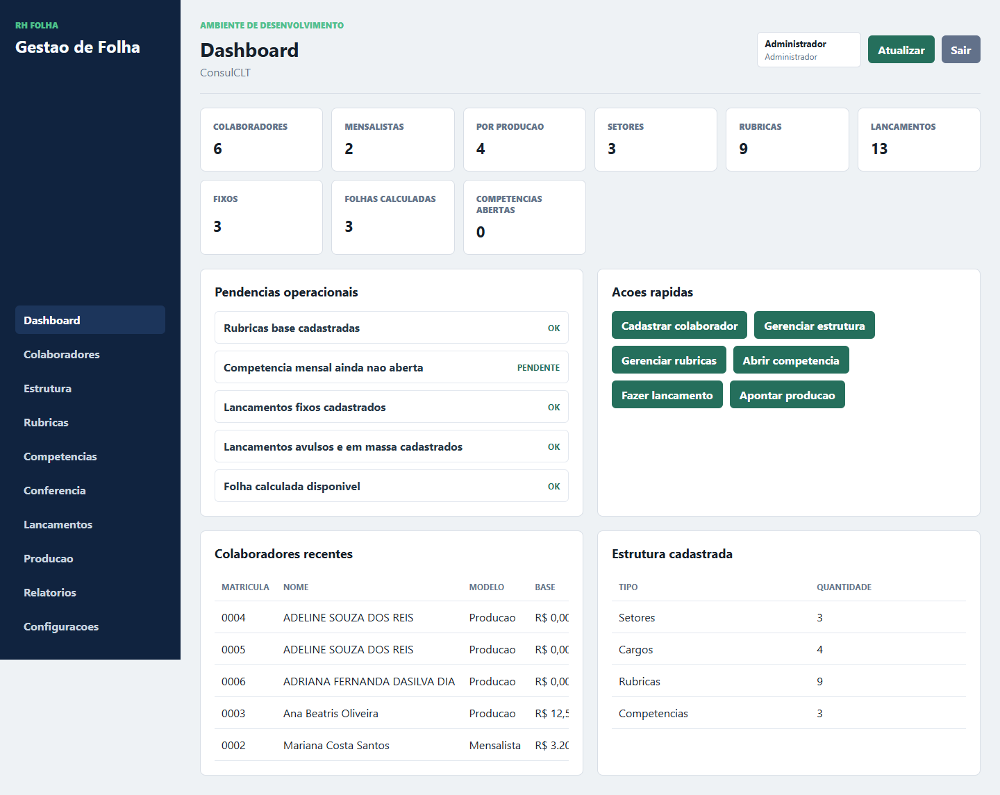

Use esta tela para conferir rapidamente:

- se ha competencia aberta;
- se as rubricas base estao cadastradas;
- se existem lancamentos fixos, avulsos ou em massa;
- se a folha calculada esta disponivel;
- atalhos para cadastrar colaborador, estrutura, rubricas, lancamentos e apontamento de producao.

## 4. Colaboradores

A tela de colaboradores concentra o cadastro principal de funcionarios e permite pesquisa por nome, matricula, setor, cargo e periodo de admissao.

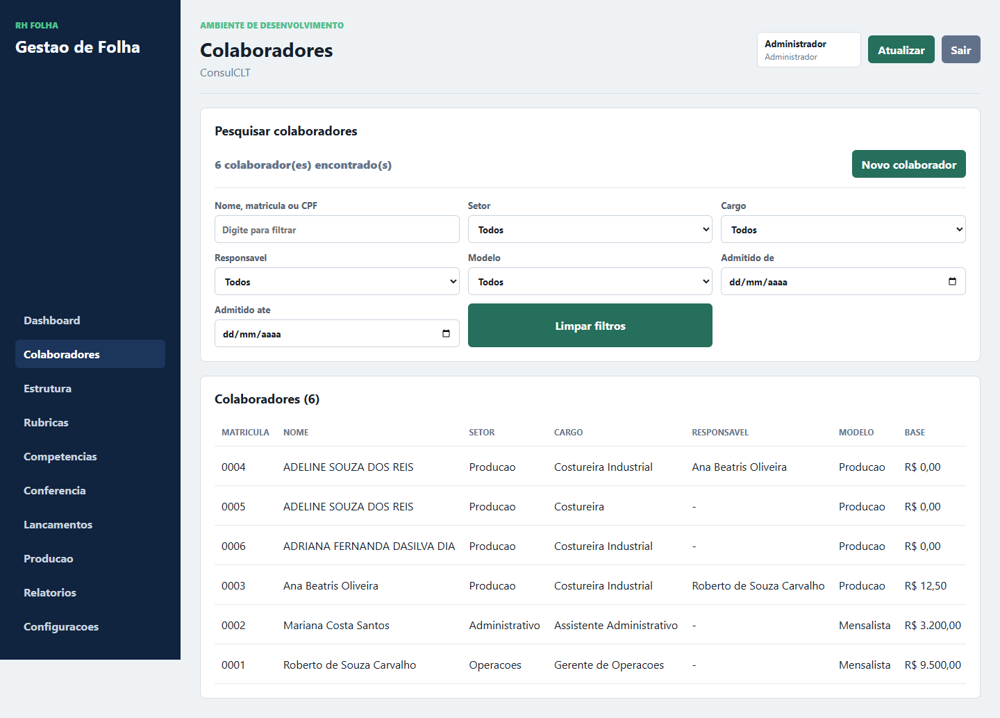

Principais recursos:

- cadastro de novo colaborador em modal;
- consulta da ficha do colaborador;
- vinculo de responsavel direto;
- upload de foto;
- acompanhamento com eventos datados, como cursos, treinamentos, ocorrencias e observacoes;
- visualizacao de lancamentos fixos vinculados ao colaborador.

Recomendacoes:

- mantenha matricula unica por colaborador;
- informe setor e cargo para facilitar filtros e lancamentos em massa;
- use responsavel direto quando houver hierarquia operacional;
- mantenha foto no servidor, nao em pasta local do computador.

## 5. Estrutura

O modulo Estrutura mantem setores e cargos da empresa.

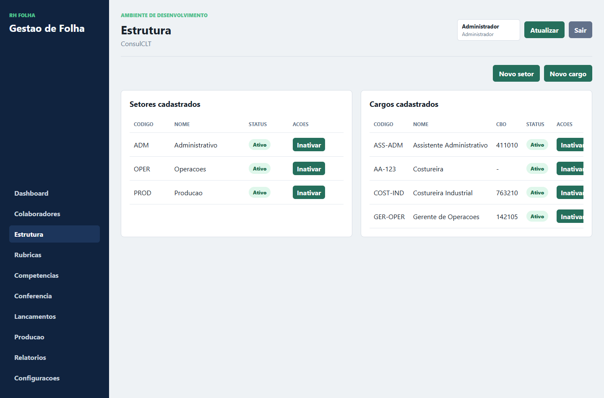

Setores representam areas internas, como Administrativo, Producao e Operacoes.

Cargos representam funcoes exercidas pelos colaboradores. O cargo pode ser usado em filtros, lancamentos em massa, regras de producao e relatorios.

Boas praticas:

- evite duplicidade de nomes;
- inative registros que nao devem mais ser usados;
- mantenha setor e cargo atualizados no colaborador.

## 6. Rubricas

Rubricas definem eventos da folha, como proventos, descontos e informativas.

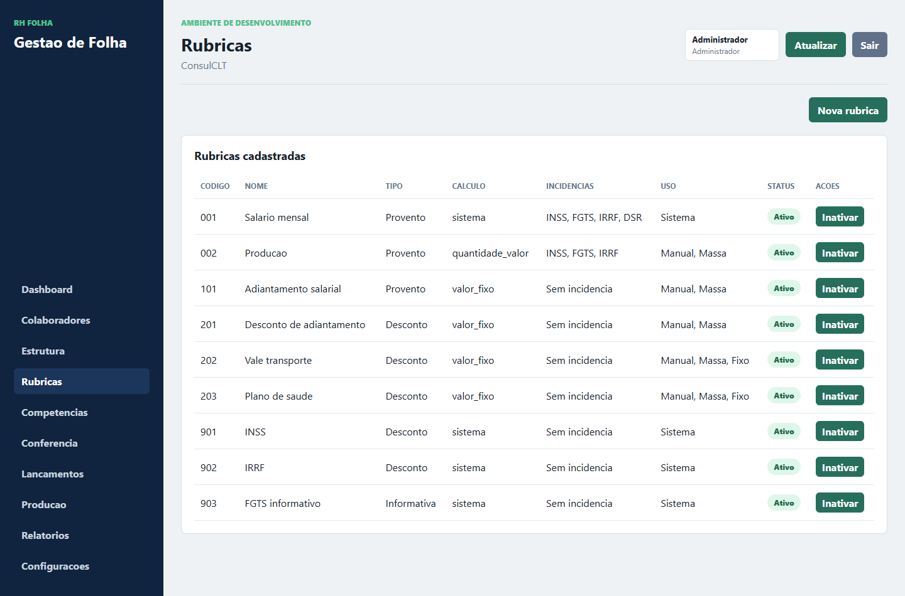

Cada rubrica pode indicar:

- codigo;
- nome;
- tipo: provento, desconto ou informativa;
- natureza;
- incidencia em bases legais;
- status;
- vigencia.

Exemplos:

- salario base;
- vale transporte;
- adiantamento salarial;
- producao;
- INSS;
- IRRF;
- FGTS informativo.

Recomendacoes:

- nao exclua rubricas historicas usadas em folhas anteriores;
- prefira inativar ou criar nova vigencia quando houver alteracao de regra;
- revise incidencias antes de calcular a folha.

## 7. Competencias

Competencia representa o periodo mensal da folha, como 2026-06.

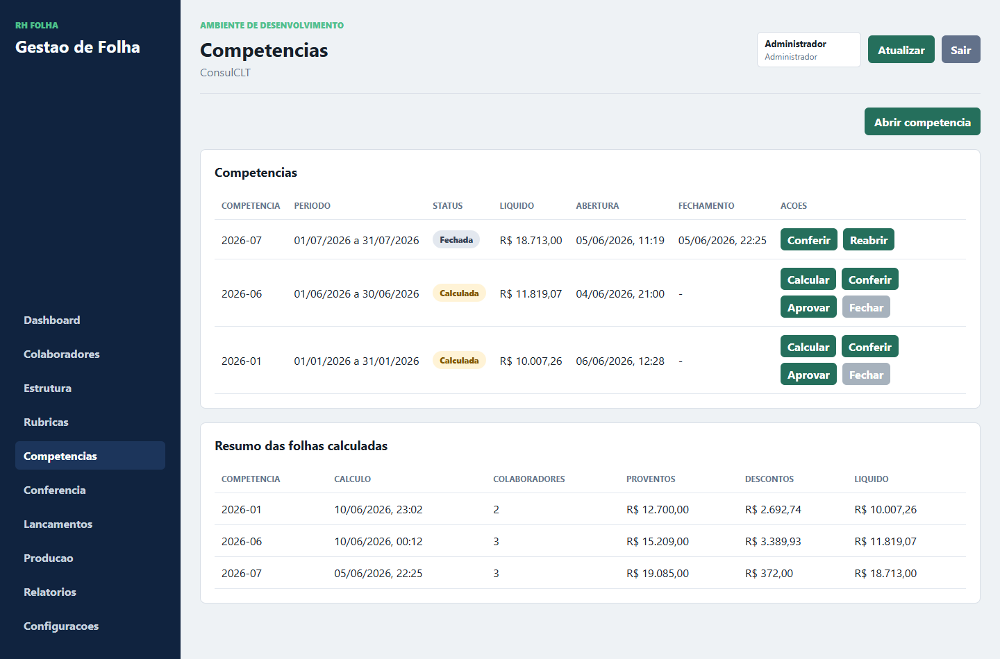

Fluxo recomendado:

1. Abrir competencia.
2. Revisar colaboradores, contratos, rubricas e tabelas.
3. Registrar lancamentos fixos, avulsos, em massa e producao.
4. Calcular folha.
5. Conferir valores por colaborador.
6. Aprovar folha.
7. Fechar competencia.

Regras operacionais:

- uma competencia fechada nao deve receber novos lancamentos;
- recalculo deve respeitar o status da competencia;
- apontamentos de producao em rascunho bloqueiam calculo da folha;
- producao aprovada pode ser integrada ao calculo da competencia.

## 8. Lancamentos

O modulo Lancamentos reune lancamentos fixos por colaborador, lancamentos avulsos, lancamentos em massa e apontamentos de producao relacionados a folha.

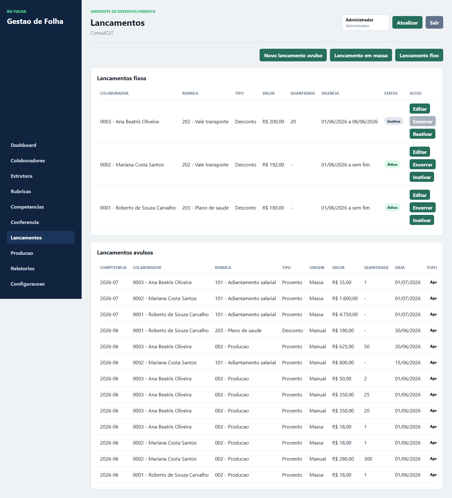

### 8.1 Lancamento fixo por colaborador

Use para eventos recorrentes de um colaborador, como descontos mensais, adicionais fixos ou beneficios.

Campos principais:

- colaborador;
- rubrica;
- inicio e fim de vigencia;
- valor;
- quantidade;
- observacao;
- status.

Quando o usuario errar ou precisar alterar um fixo:

- edite dados ainda validos para periodos futuros;
- encerre vigencia quando o lancamento nao deve continuar;
- inative quando nao deve ser aplicado;
- evite alterar passado ja calculado ou fechado.

### 8.2 Lancamento avulso

Use para um evento pontual de uma competencia, como bonus, desconto eventual ou ajuste especifico.

### 8.3 Lancamento em massa

Use quando o mesmo evento deve ser aplicado a varios colaboradores.

Recursos:

- filtro por setor;
- filtro por cargo;
- selecao individual ou marcar todos;
- valor padrao;
- quantidade padrao;
- observacao padrao;
- calculo por valor fixo ou percentual sobre salario.

## 9. Producao

O modulo Producao concentra os apontamentos de colaboradores que recebem por producao.

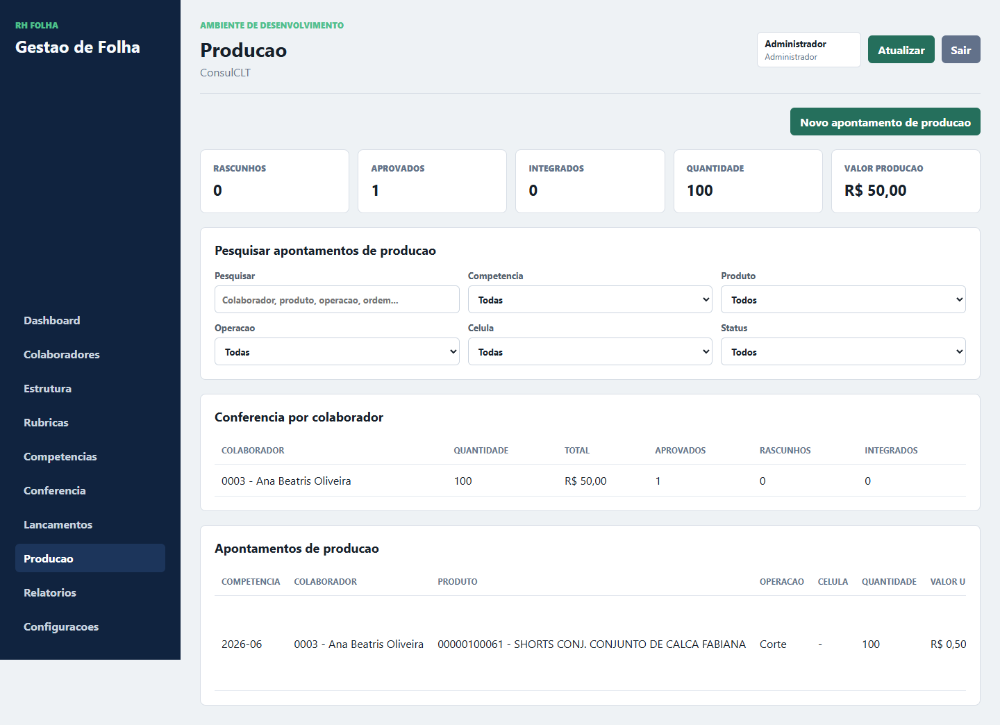

Principais recursos:

- novo apontamento individual;
- pesquisa por colaborador, produto, operacao ou ordem;
- filtros por competencia, produto, operacao, celula e status;
- conferencia por colaborador;
- status de rascunho, aprovado, cancelado e integrado;
- totalizacao de quantidade e valor.

Fluxo recomendado:

1. Registrar apontamento de producao.
2. Manter em rascunho ate conferencia.
3. Aprovar apontamento valido.
4. Calcular a folha.
5. O calculo integra apontamentos aprovados.

Regras importantes:

- apontamento em rascunho nao entra na folha;
- apontamento aprovado entra no calculo da competencia;
- apontamento integrado nao deve ser alterado livremente;
- se houver erro apos integracao, o ajuste deve seguir regra operacional definida pela empresa.

## 10. Relatorios e holerites

O modulo Relatorios apresenta a conferencia e emissao de documentos da folha.

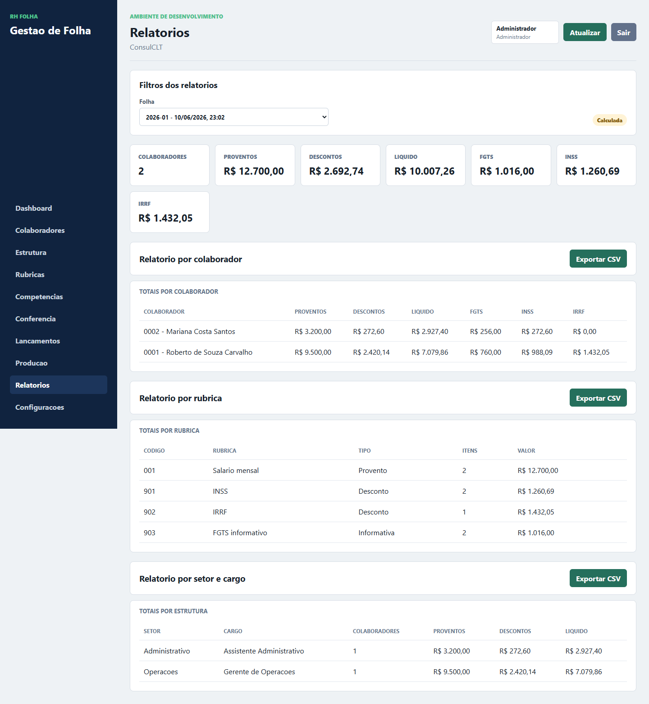

O holerite por colaborador deve mostrar:

- dados do colaborador;
- competencia;
- proventos;
- descontos;
- informativas, como FGTS;
- bases legais de FGTS, INSS e IRRF;
- liquido final.

Recursos previstos ou implementados:

- impressao individual em nova aba;
- impressao de todos os holerites;
- futura exportacao em PDF.

## 11. Configuracoes

Configuracoes foi organizado em abas para reduzir poluicao visual.

### 11.1 Empresa

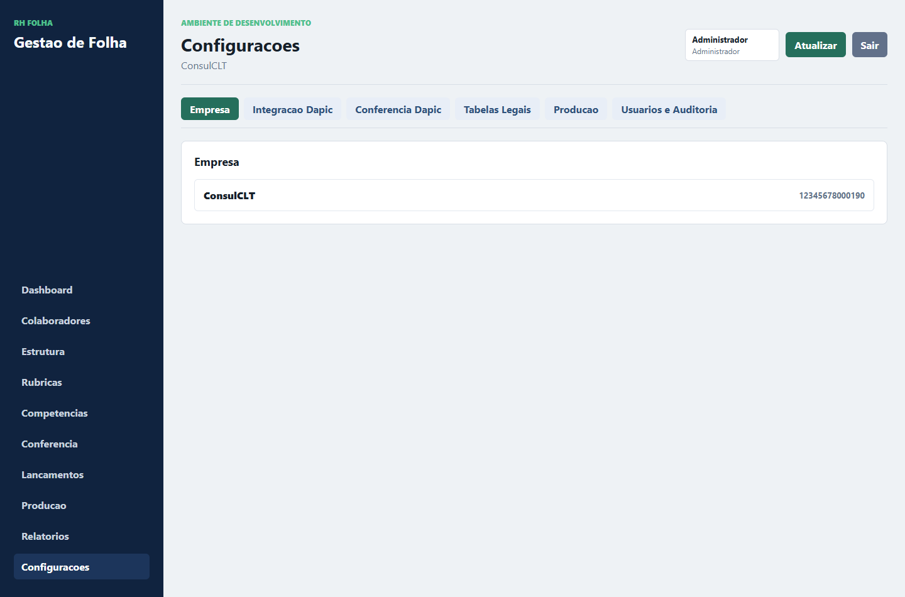

Use para consultar ou ajustar dados gerais da empresa ativa.

### 11.2 Integracao Dapic

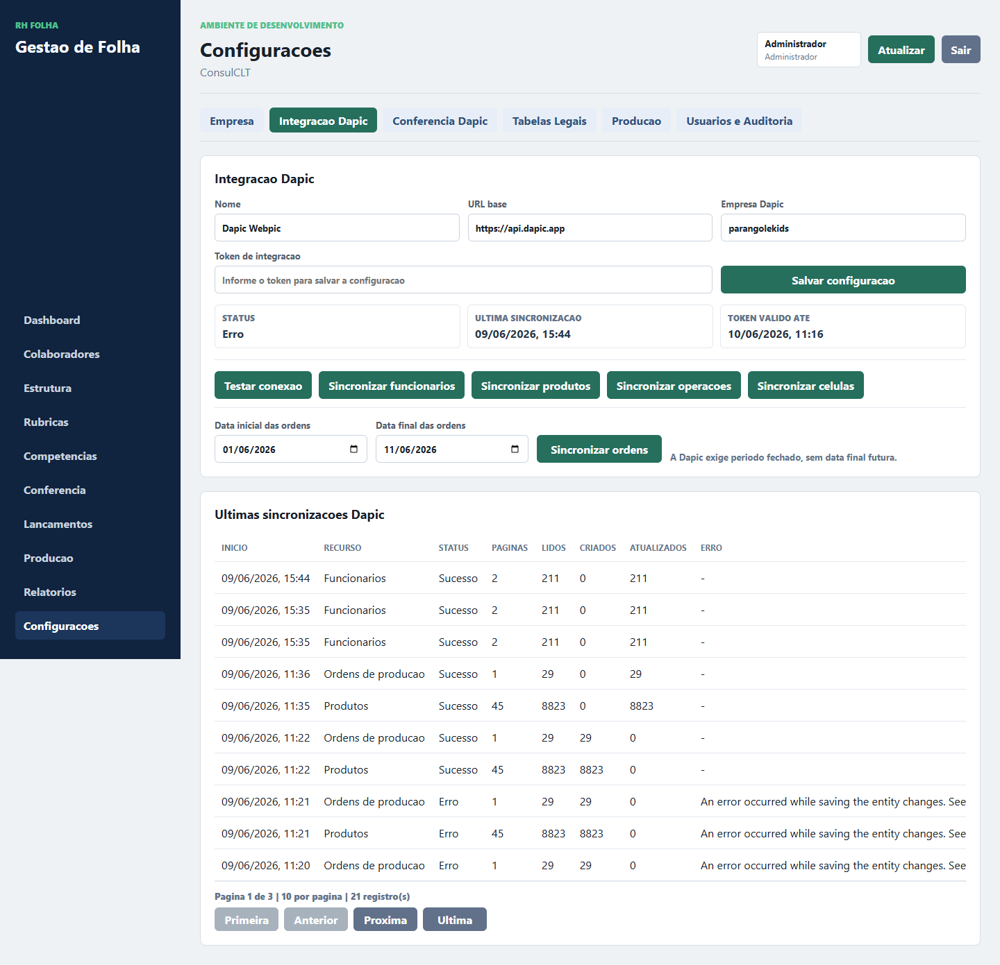

Esta aba configura a integracao com o Dapic da Webpic.

Campos principais:

- nome da integracao;
- URL base;
- empresa Dapic;
- token de integracao;
- data inicial e final das ordens.

Acoes disponiveis:

- testar conexao;
- sincronizar funcionarios;
- sincronizar produtos;
- sincronizar operacoes;
- sincronizar celulas;
- sincronizar ordens.

Observacao: para ordens de producao, o Dapic exige periodo fechado com data inicial e data final validas.

### 11.3 Conferencia Dapic

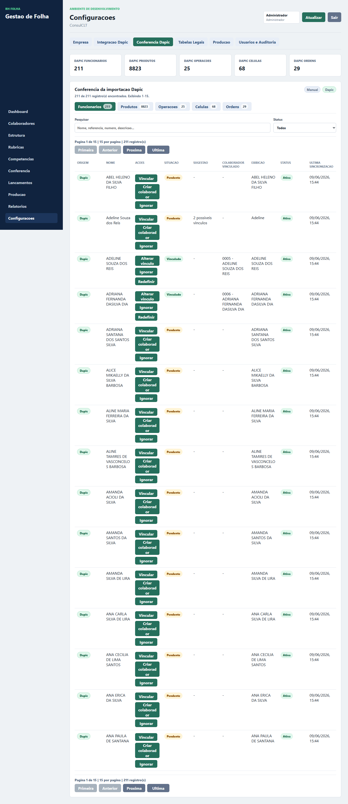

Esta aba mostra registros importados do Dapic e permite conferencia antes de uso operacional.

Regras:

- registros Dapic entram como espelho de origem externa;
- o usuario decide se vincula, cria colaborador, ignora ou usa em apontamento;
- a origem deve ficar visivel por badge;
- ID externo pode ficar tecnico e nao precisa aparecer para usuario final em todas as tabelas.

Para funcionarios importados:

- o sistema pode sugerir vinculo quando encontrar colaborador parecido;
- se nao existir colaborador, o usuario pode criar e vincular;
- registros pendentes devem ser revisados antes de uso na folha.

### 11.4 Tabelas legais

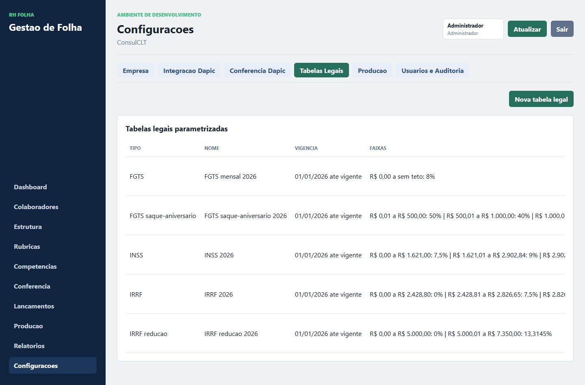

Use para manter tabelas de INSS, IRRF, FGTS e demais bases legais.

Boas praticas:

- registre vigencia;
- nao altere tabela antiga usada em folha fechada;
- crie nova vigencia para novas regras;
- mantenha fonte normativa em observacao quando aplicavel.

### 11.5 Producao

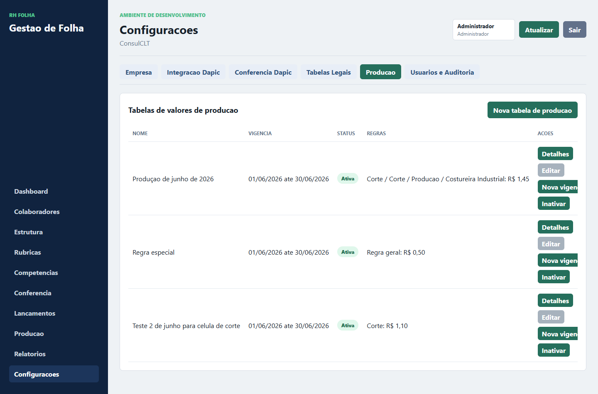

Esta aba mantem tabelas de valores de producao.

Regras de producao podem considerar:

- produto;
- operacao;
- celula;
- cargo;
- setor;
- vigencia;
- prioridade.

Prioridade recomendada:

1. regra mais especifica;
2. regra por produto + operacao + celula;
3. regra por produto + operacao;
4. regra por operacao;
5. regra geral vigente.

Ao alterar valores, prefira criar nova vigencia em vez de alterar historico.

### 11.6 Usuarios e auditoria

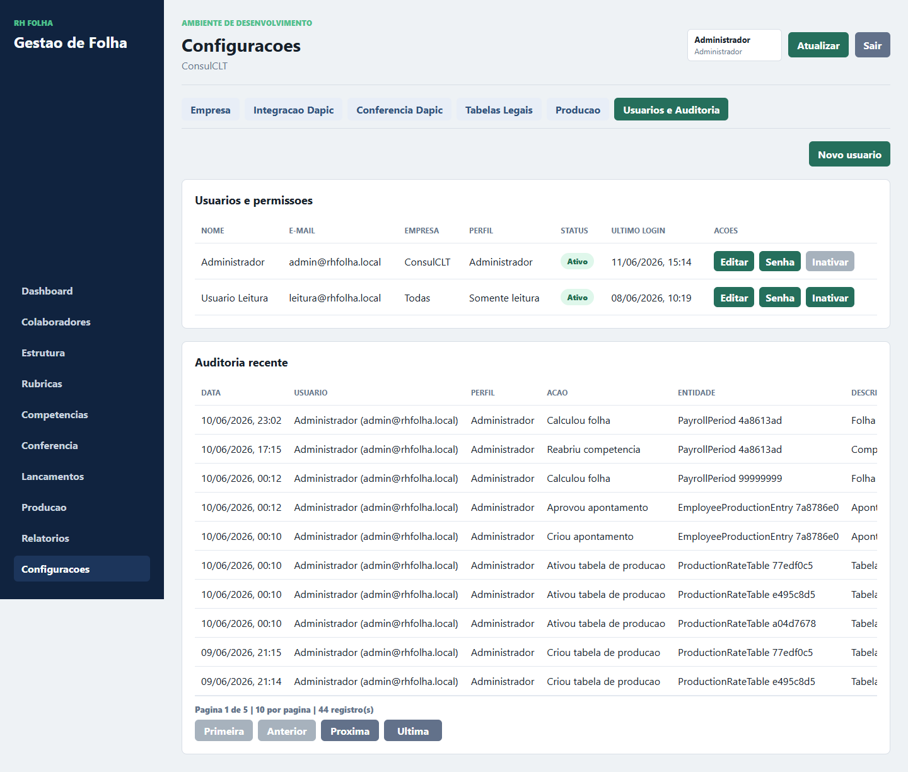

Esta aba permite manutencao de usuarios e consulta de auditoria recente.

Perfis recomendados:

- Administrador;
- RH operacional;
- Folha;
- Aprovador;
- Somente leitura.

Regras:

- usuario somente leitura nao deve acessar formularios de cadastro;
- acoes bloqueadas devem ser escondidas ou desabilitadas antes do envio;
- a auditoria deve registrar criacao, alteracao, aprovacao, fechamento, reabertura, upload e sincronizacoes relevantes.

## 12. Fluxo mensal recomendado da folha

1. Revisar configuracoes legais e estrutura.
2. Abrir competencia.
3. Conferir colaboradores ativos.
4. Conferir lancamentos fixos vigentes.
5. Registrar lancamentos avulsos e em massa.
6. Registrar e aprovar producao.
7. Calcular folha.
8. Conferir folha por colaborador.
9. Emitir holerites.
10. Aprovar folha.
11. Fechar competencia.

## 13. Fluxo recomendado para producao

1. Sincronizar dados Dapic quando necessario.
2. Conferir produtos, operacoes, celulas e ordens.
3. Manter tabelas de valores de producao.
4. Registrar apontamento individual.
5. Aprovar apontamento conferido.
6. Calcular folha da competencia.
7. Conferir valores integrados.

## 14. Cuidados operacionais

- Evite alterar dados historicos de competencia fechada.
- Use vigencia para regras que mudam com o tempo.
- Revise tabelas legais antes do primeiro calculo real do mes.
- Faca backup do banco e da pasta de uploads.
- Valide permissoes antes de liberar o sistema para novos usuarios.
- Em homologacao, execute testes com dados reais controlados antes da producao.

## 15. Pendencias futuras previstas

Itens planejados para evolucao:

- controle de ponto e biometria;
- ferias;
- afastamentos;
- integracao com contas a pagar no ERP;
- exportacao PDF avancada dos holerites;
- Playwright para testes automatizados dos fluxos principais;
- painel mais completo de auditoria e logs operacionais.
